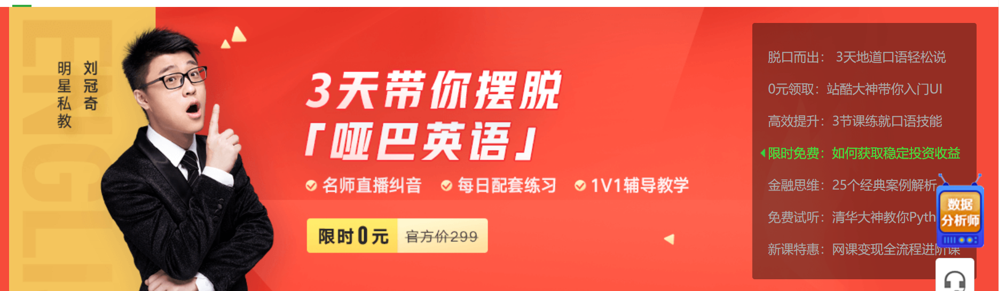
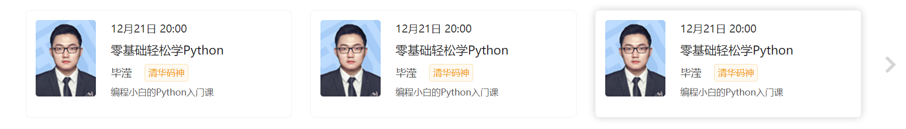
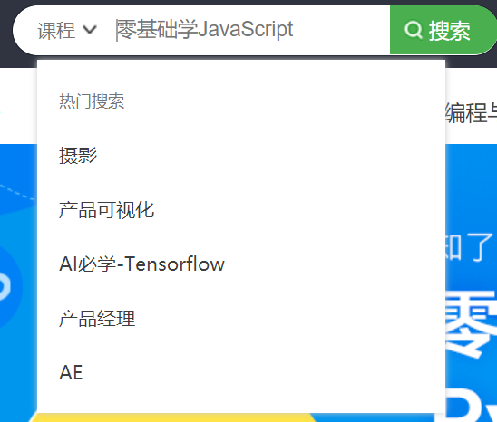
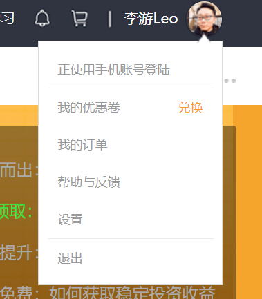

<h1><center>专题一  网易云课堂首页项目</center></h1>

### 首页轮播图动态效果制作

实现效果：鼠标移动到导航栏进行轮播图的切换



实现思路：为轮播图的导航栏的所有项绑定一个处理函数，当鼠标光标移动到导航栏时就会触发这个函数，这个函数中首先需要先清理上一个定时器，然后设置一个新的定时器，用来将选中的轮播图显示出来。

核心代码：

```js
slide:function(){
    var timer = null ;
    var allSliderButton = document.getElementsByClassName('slider-content-button')[0];//获取轮播图的导航栏所有内容
    var allSliderContent =document.getElementsByClassName('slider-content-UlNode')[0].children;//获取轮播图的所有内容
    var allLi = allSliderButton.children;
    for(var i = 0;i<allLi.length;i++){
    allLi.index = i;//标记当前选中项
    allLi[i].onmouseover = function(){
        clearInterval(timer);//每次开始鼠标移动到导航栏首先清除定时器
        timer = setTimeout(function(){//设置新的定时器
            for(var i = 0;i<allLi.length;i++){
                allSliderContent[i].style.display = 'none';//将所有图片进行隐藏
                if(allLi[i].className.indexOf('first')!=-1){//防止原有first样式被删除，如果原来存在first就给它保留
                    allLi[i].className = 'first';
                } 
                else{
                    allLi[i].className = '';//原来没有first，就将class清空
                }
            }
            allSliderContent[this.index].style.display = 'block';//将选中的图片进行显示
            this.className+=' active';//给选中的项添加active样式
        }.bind(this),500)
    }
} 
}


```

### 二级菜单效果制作

实现效果：二级菜单效果，鼠标移动到菜单项，出现下拉框。


实现思路：使用onmouseover和onmouseleave，在它们的处理函数中分别实现对应菜单项下拉框的显示和隐藏。

核心代码：

```js
bannerShow:function(){
    var allLi = document.getElementsByClassName('banner-a');//获取二级导航栏所有元素
    var allshowOl = document.getElementsByClassName('active-ol');//获取下拉框
    for (var i = 0;i < allLi.length;i++){
        allLi[i].onmouseover = function(){//当鼠标移动到二级导航栏每一项元素时绑定事件处理函数
            for(var i = 0 ;i<allshowOl.length;i++){
                allshowOl[i].style.display = 'none';//将所有下拉框都隐藏起来
            }
            if(this.parentNode.getElementsByClassName('active-ol')[0]){  //如果该导航栏有下拉框                            
             this.parentNode.getElementsByClassName('active-ol')[0].style.display='block';//就将该导航栏下拉框显示            
            }
            
        }
    }
    topBanner.onmouseleave= function(){//当鼠标完全离开导航项执行处理函数将所有下拉框隐藏
        for(var i = 0;i < allshowOl.length;i++ ){
            allshowOl[i].style.display = 'none';
        }
    }
    
}
```

### 名师公开课按钮事件制作

实现效果：点击左右箭头按钮，名师列表进行左右滑动。



实现思路：获取对应的元素的位置信息进行合理的加减。

```js
openShow:function(){
    var leftBtn = document.getElementsByClassName('card-left')[0];//获取左边箭头按钮
    var rightBtn = document.getElementsByClassName('card-right')[0];//获取右边箭头按钮
    var openUl = document.getElementsByClassName('open-content-slider-card')[0];//获取滑动列表所有项
    rightBtn.style.display = 'none';//对右箭头按钮进行隐藏
    leftBtn.onclick = function(){//当点击左边箭头时
        this.style.display = 'none';
        rightBtn.style.display = 'block';
        openUl.style.left = '-368px';
    }
     rightBtn.onclick = function(){//当点击右边箭头时
        this.style.display = 'none';
        leftBtn.style.display = 'block';
        openUl.style.left = '0px';
    }
} 
```

### 搜索栏事件制作

实现效果：光标移动到搜索框内弹出历史下拉框，并且随着左边选项切换，从而实现输入框内容的切换和下拉框内容的切换。



实现思路：通过类名或者id获取对应dom元素进行内容添加替换，然后使用onmouseout，onmouseover，onmouseenter，onmouseleave来实现什么时间显示和隐藏下拉框。

```js
searchEvent:function(){
			var searchLeftChangeButton = document.getElementsByClassName('searchNodeLeft')[0];
			var searchLeftUl = document.getElementsByClassName('searchNodeLeft-ul')[0];
			var searchLeftUlAllNode = searchLeftUl.children;
			var searchShowOl = document.getElementsByClassName('searchNode-ol')[0];
			var searchInput = document.getElementsByClassName('searchNodeInput')[0];
			var searchNodeLeftText = document.getElementsByClassName('searchNodeLeftText')[0];
			var searchShowOlAllNode = searchShowOl.children;
			var context = {
				'k':['摄影','产品可视化','AI必学-Tensorflow','产品经理','AE'],
				'w':['城市','滨州医学院','51','edufancy','北京理工大学']
			};


			window.onclick = function(){
				searchShowOl.style.display = 'none';
			}
			ToOlContent('k');
			function ToOlContent(text){//历史搜索下拉框内容的添加

				var searchShowOlAllNode = searchShowOl.children;
				searchShowOl.innerHTML = "<li class='first'>热门搜索</li>"
				searchShowOlAllNode[0].onclick = function(){
					event.cancelBubble = true;
				};
				for(var i = 0;i < context[text].length;i++){
					var oLi = document.createElement('li');
					oLi.innerHTML = '<a href="#">'+context[text][i]+'</a>';
					searchShowOl.appendChild(oLi);
				}
				for(var i = 1;i < searchShowOlAllNode.length;i++){
					searchShowOlAllNode[i].onclick = function(){
						event.cancelBubble = true;
						searchShowOl.style.display = 'none';
						
					}
				}
			}

			

			for(var i = 0;i < searchLeftUlAllNode.length;i++){
				searchLeftUlAllNode[i].onclick = function(){
					event.cancelBubble = true;
					for(var i =0;i < searchLeftUlAllNode.length;i++){
						searchLeftUlAllNode[i].className = '';
					};
					searchNodeLeftText.innerHTML = this.innerHTML;
					this.className = 'active';
					searchLeftUl.style.display = 'none';
					OlShow();

					if(this.innerHTML=='网校'){
						searchInput.placeholder = '搜索网校';
						ToOlContent('w')
					}
					else{
						searchInput.placeholder = '零基础学JavaScript';
						ToOlContent('k')
					}
				};
			};

			searchLeftChangeButton.onmouseover = function(){
				//console.log(event.target.nodeName);
				if(event.target.nodeName == 'DIV' || event.target.nodeName == 'SPAN'){
					searchLeftChangeButton.className = 'searchNodeLeft active';
				}
				else{
					searchLeftChangeButton.className = 'searchNodeLeft';
				}
			};
			searchLeftChangeButton.onmouseout = function(){
				searchLeftChangeButton.className = 'searchNodeLeft';
			}

			function OlShow(){  //下拉框的显示效果
				searchShowOl.style.transition = '0.7s';
				searchShowOl.style.opacity = '0';
				searchShowOl.style.display = 'block';
				setTimeout(function(){
					searchShowOl.style.opacity = '1';
				},0);
			}

			searchInput.onclick = function(){
				event.cancelBubble = true;
				OlShow();
			}
			//searchInput.onfocus = OlShow;

			searchLeftChangeButton.onmouseenter = function(){
				searchLeftUl.style.display = 'block';
				searchShowOl.style.display = 'none';
			};

			searchLeftChangeButton.onmouseleave = function(){
				searchLeftUl.style.display = 'none';
			};


		},
}
```

### 用户图像触碰下拉菜单效果展示

实现效果：头像下拉框基本的显示和隐藏，还有一个变大的渐进效果实现。



实现思路：通过类名或者id获取对应dom元素进行内容添加替换，然后使用onmouseout，onmouseover，onmouseenter，onmouseleave来实现什么时间显示和隐藏下拉框，最后需要熟悉transform，transition，最后清楚渐变效果要加定时器实现

```js
userImageTouch:function(){
			var userImage = document.getElementsByClassName('user-image')[0];
			var userUl = document.getElementsByClassName('user-ul')[0];
			var myContent = document.getElementsByClassName('bannerTop-my-content')[0];
			var timer = null;

			userImage.onmouseover = function(){
				clearTimeout(timer);
				if(userUl.style.display == 'block')return;
				myContent.style.display = 'none';
				userUl.style.display = 'block';
				userUl.style.transform = 'scale(0.9)';//下拉框缩小
				userUl.style.transition = '0.17s';//设置下拉框渐变时间
				setTimeout(function(){//必须要加定时器实现
					userUl.style.transform = 'scale(1)';//下拉框还原
				},0);
			}
			userImage.onmouseout = function(){//使用定时器实现延时菜单消失
				clearTimeout(timer);
				timer = setTimeout(function(){
					userUl.style.display = 'none';
				},300);
			};

			userUl.onmouseover = function(){
				clearTimeout(timer);
			};
			userUl.onmouseout = function(){//使用定时器实现延时菜单消失
				clearTimeout(timer);
				timer = setTimeout(function(){
					userUl.style.display = 'none';
				},300);
			};
		}
```

#### 我的学习按钮触碰下拉菜单效果展示

实现效果：我的学习下拉框基本的显示和隐藏，还有一个变大的渐进效果实现。


实现思路：与实现用户图像触碰下拉菜单相似。

```js
myTouch:function(){
			var myButton = document.getElementsByClassName('bannerTop-my')[0];
			var myContent = document.getElementsByClassName('bannerTop-my-content')[0];
			var timer = null;
			myButton.onmouseover = function(){
				clearTimeout(timer);
				if(myContent.style.display == 'block')return;
			myContent.style.display = 'block';
				myContent.style.display = 'block';
				myContent.style.transform = 'scale(0.9)';//下拉框缩小
				myContent.style.transition = '0.17s';//设置渐变时间
				setTimeout(function(){
					myContent.style.transform = 'scale(1)';//下拉框还原
				},0);
			};

			myButton.onmouseout = function(){
				clearTimeout(timer);
				timer = setTimeout(function(){
					myContent.style.display = 'none';
				},100);
			};

			myContent.onmouseover = function(){
				clearTimeout(timer);
			};
			myContent.onmouseout = function(){
				clearTimeout(timer);
				timer = setTimeout(function(){
					myContent.style.display = 'none';
				},100);
			};
		},
```

### 头部吸顶条效果制作

实现效果：鼠标往下滑，顶部栏始终显示在页面顶部。


实现思路：熟悉onscroll的用法

核心代码：

```js
windowScroll:function(){
			var topNode = document.getElementsByClassName('topNode')[0];
			var topNodeCopy = document.getElementsByClassName('topNode-copy')[0];
			var windowShow = document.getElementsByClassName('window-show')[0];
			var showT = document.getElementsByClassName('show-t')[0];
			var timer = null;
			window.onscroll=function(){//onscroll事件在元素滚动条在滚动时触发

				if(document.documentElement.scrollTop>=1){
					windowShow.style.display = 'block';
				}
				else{
					windowShow.style.display = 'none';
				}

				if(document.documentElement.scrollTop>=550){//如果滑动距离超过550
					topNode.style.position = 'fixed';
					topNodeCopy.style.display = 'block';//让占位的部分显示出来，目的是避免原来部分浮动后改变布局
				}
				else{
					topNode.style.position = 'relative';
					topNodeCopy.style.display = 'none';
				}
				//console.log(document.documentElement.scrollTop)
			};

			showT.onclick = function(){
				clearInterval(timer);
				timer = setInterval(function(){
					if(document.documentElement.scrollTop<=0){
						clearInterval(timer);
						return;
					}
					document.documentElement.scrollTop = document.documentElement.scrollTop - 100 < 0? 0 :document.documentElement.scrollTop - 100;
				},0);
			};
		},
```

